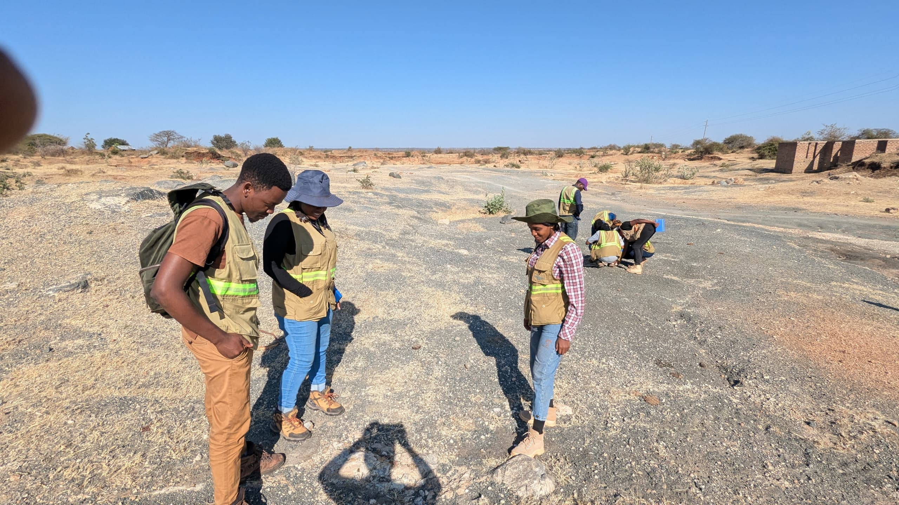
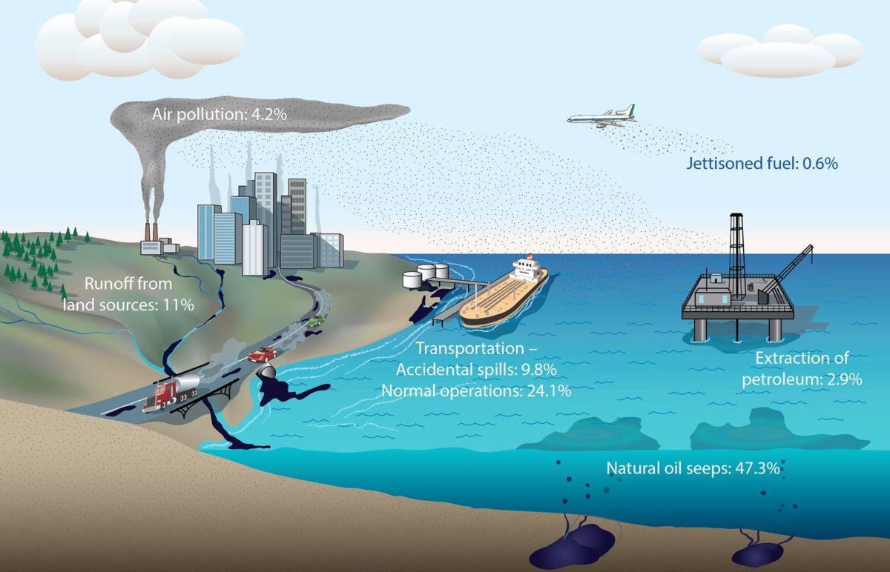

<html lang="en">
<head>
  <meta charset="UTF-8" />
  <meta name="viewport" content="width=device-width, initial-scale=5.0" />
  <title>Mosempanji Aquifer Oil Genesis Ltd</title>
  
</head>
<body>
  <header>
    
    

      <h1>Mosempanji Aquifer Oil Genesis Ltd</h1>
      
<em>Smoothening the future</em>

    

  </header>

  <nav>
    <a href="#home">Home</a>
    <a href="#about">About Us</a>
    <a href="#products">Products</a>
    <a href="#services">Services</a>
    <a href="#contact">Contact</a>
  </nav>

  

    

      
      
      
     
    

  

  <section id="home">
    <!-- Removed the h2 and p tags as requested -->
  </section>

  <section id="about">
    <h2>About Us</h2>
    
Mosempanji Aquifer Oil Genesis Ltd is a leading provider of energy solutions, specializing in the supply of premium gasoline and hydrocarbons to meet the growing demands of the industrial and commercial sectors. With a vision rooted in innovation, sustainability, and excellence, our company was established to bridge the energy needs of local and international markets through seamless importing and logistics services.

    
We pride ourselves on our commitment to environmental responsibility and customer satisfaction. Our operations are designed to ensure efficient sourcing, safe transportation, and timely delivery of petroleum products. Through strategic partnerships and a dedicated team of professionals, Mosempanji Aquifer Oil Genesis Ltd strives to play a key role in the development of reliable energy infrastructure and economic progress.

    
From sourcing quality hydrocarbons globally to delivering them at your doorstep, we handle everything with precision and care. Trust us to power your industry, business, or community with integrity and a smooth approach to energy supply.

  </section>

  <section id="products">
    <h2>Our Products</h2>
    <ul>
      <li><strong>Gasoline:</strong> High-quality fuel for vehicles and industrial machines, ensuring performance and efficiency.</li>
      <li><strong>Hydrocarbons:</strong> A wide range of refined petroleum products used across multiple energy and manufacturing sectors.</li>
    </ul>
  </section>

  <section id="services">
    <h2>Our Services</h2>
    <ul>
      <li><strong>Logistics Solutions:</strong> End-to-end energy product delivery through road, rail, and sea logistics.</li>
      <li><strong>Importing Energy Products:</strong> We specialize in bringing in quality gasoline and hydrocarbons from international sources to ensure local energy stability.</li>
    </ul>
  </section>

  <section class="product-inquiry">
    <h3>Request a Product</h3>
    <form>
      <label for="name">Your Name</label>
      <input type="text" id="name" name="name" required>

      <label for="email">Email</label>
      <input type="email" id="email" name="email" required>

      <label for="product">Product Description / Inquiry</label>
      <textarea id="product" name="product" rows="4" required></textarea>

      <button type="submit">Submit Request</button>
    </form>
  </section>

  <section id="contact">
    <h2>Contact Us</h2>
    
Email: <a href="mailto:mosesmpanji123@gmail.com">mosesmpanji123@gmail.com</a>

  </section>

  <footer>
    
&copy; 2025 Mosempanji Aquifer Oil Genesis Ltd. All rights reserved.

  </footer>
</body>
</html>
